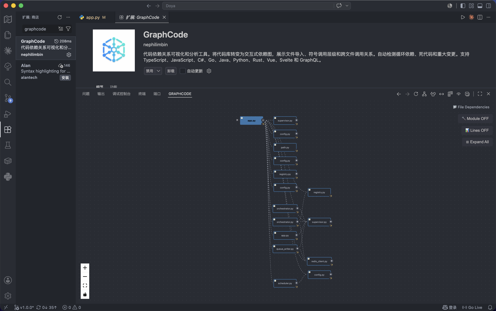
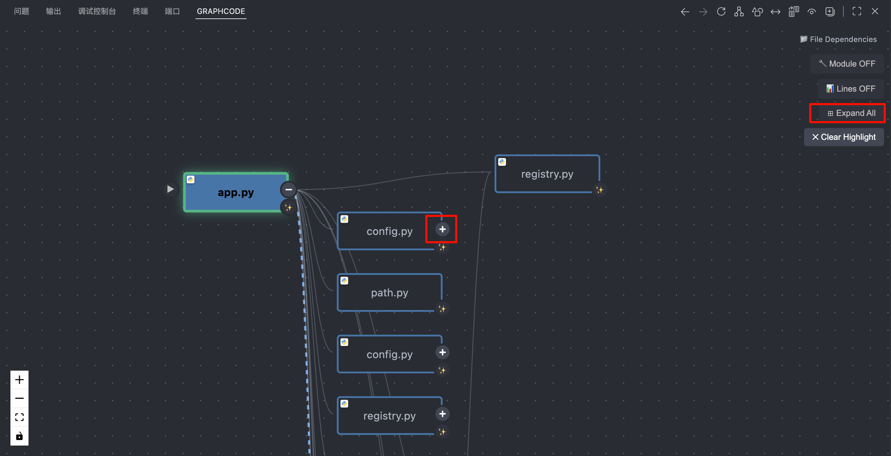
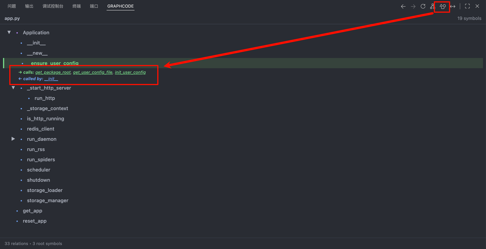
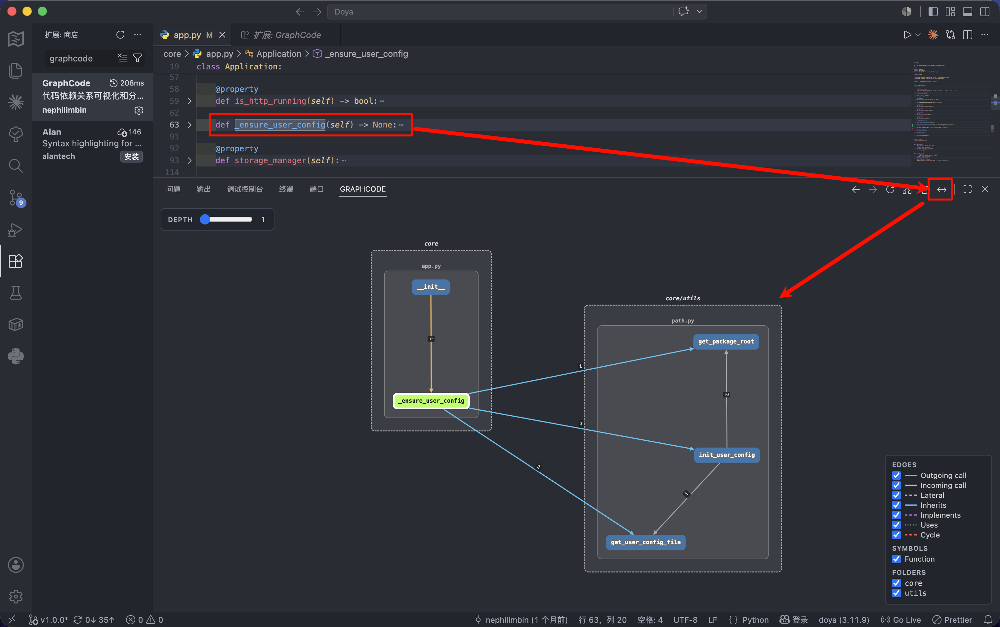
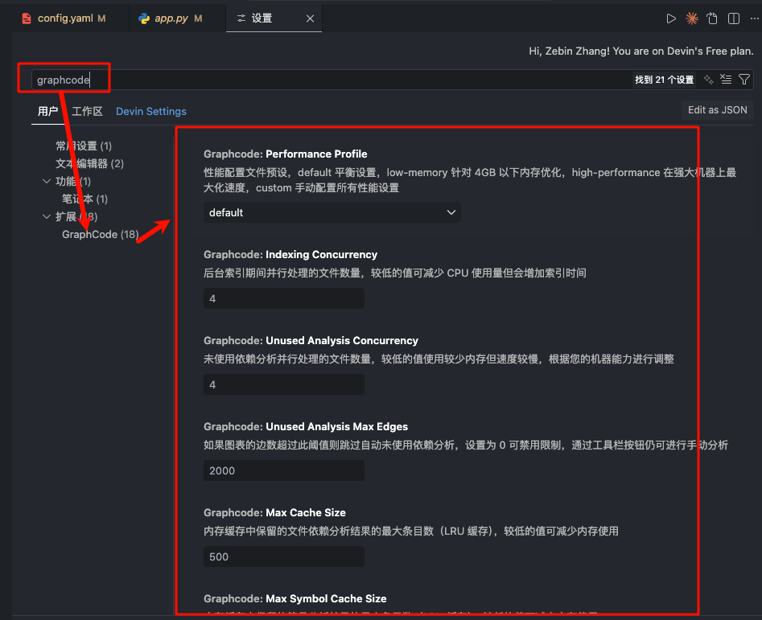

# GraphCode

  

<h3 align="center">
  代码依赖关系智能分析工具
</h3>

  让开发者可以掌控代码布局与架构。

---

GraphCode 将您的代码库转变为实时的、交互式的依赖关系图。

为需要全局视野的**架构师**和追求代码质量的**开发者**而构建，它在一个工具中结合了三个分析层次：

| 层次 | 您看到的 | 基于技术 |
|-------|-------------|------------|
| **文件图** | 文件间的导入关系 | Regex + AST 解析 |
| **符号视图** | 文件内的函数/类调用层级 | AST (ts-morph) |
| **实时调用图** | 跨文件的符号调用关系 | Tree-sitter + SQLite |

  

---

## 为什么选择 GraphCode？

| 痛点 | 没有 GraphCode | 使用 GraphCode |
|---|---|---|
| "如果修改这个文件会破坏什么？" | Grep + 希望 | 一键反向依赖查找 |
| "是否有循环依赖？" | 手动追踪 | 自动检测，红色高亮显示循环 |
| "项目中哪些地方调用了这个函数？" | 全局搜索 + 噪音 | 带深度控制的实时调用图 |
| "让新开发者上手" | 数小时的讲解 | 交互式图 |

---

## 目录

- [GraphCode](#graphcode)
  - [为什么选择 GraphCode？](#为什么选择-graphcode)
  - [目录](#目录)
  - [人类可用的功能](#人类可用的功能)
    - [文件依赖图](#文件依赖图)
    - [符号级别深入](#符号级别深入)
    - [实时调用图 *（新功能）*](#实时调用图-新功能)
  - [系统要求](#系统要求)
  - [安装](#安装)
    - [从市场安装](#从市场安装)
  - [配置](#配置)
    - [性能配置文件](#性能配置文件)
    - [所有设置](#所有设置)
  - [许可证](#许可证)
  - [致谢](#致谢)

---

## 人类可用的功能

### 文件依赖图

GraphCode 的核心：一个**实时交互式图**，显示项目中文件间的导入关系。

- **多语言支持：** TS/JS/Python/Rust/C#/Go/Java/Swift
- **循环检测：** 用红色虚线和徽章突出显示循环依赖
- **智能导航：** 点击任何节点打开文件；动态展开/折叠依赖
- **反向查找：** 右键 → "查找引用文件" 以即时反向依赖发现
- **后台索引：** 在后台线程中索引工作区，实现 O(1) 查询
- **模块路径：** 显示模块路径，便于理解文件间的相对关系
- **代码行数：** 显示代码行数，便于模块瘦身

  
  
<em>带展开/折叠检测的交互式文件依赖图</em>

### 符号级别深入

超越文件依赖 — **深入任何文件以可视化函数对函数和类对类的调用关系**，由 AST 分析驱动.

**工作原理：**

1. **从文件图：** 点击导航中"切换至符号视图
2. **即时符号图：** 看到一个交互树状图.
3. **点击导航：** 点击任何符号跳转到其定义,查看调用和被调用关系

**多语言支持（符号深入）：**
- TypeScript / JavaScript
- Python
- Rust
- Swift

**注意:** 部分语言暂未支持,将陆续开放.

  
  
<em>符号深入：类、函数、及其调用关系</em>

### 实时调用图 *（新功能）*

**实时调用图**在面板中可视化整个项目中**跨文件的符号调用关系**，由内存中的 SQLite 数据库支持。

与符号视图（通过 AST 显示*单个文件内*的关系）不同，调用图使用 Tree-sitter AST 提取显示符号如何在*文件间*相互调用。

**核心功能：**

| 功能 | 描述 |
|---------|-------------|
| **跨文件分析** | 查看跨越多个文件的函数调用 |
| **邻域查询** | 从任何符号进行 BFS 扩展，可配置深度（1–5） |
| **循环检测** | 相互递归和自递归以红色突出显示 |
| **复合节点布局** | 符号按文件夹分组以提高视觉清晰度 |
| **调用顺序编号** | CALLS 边编号以显示调用顺序 |
| **主题感知** | 适应深色、浅色和高对比度 VS Code 主题 |
| **实时刷新** | 保存文件时，图自动更新（500ms 防抖） |
| **过滤器图例** | 按符号类型（函数、类、变量）和文件夹切换可见性 |

**如何使用：**

1. 打开源文件并将光标放在符号（函数、类、方法...）上。然后打开命令面板 → `GraphCode: 显示调用图` 或单击侧边栏工具栏中的"显示调用图"按钮
2. 扩展索引您的工作区（Tree-sitter AST 提取）
3. 单击任何符号以重新居中邻域
4. **拖动任何节点**（符号或整个文件/文件夹组）以自由重新排列布局
5. 使用深度滑块扩展或缩小视图
6. 使用图例叠加按符号类型或文件夹过滤

  
  
<em>实时调用图 — 带循环检测和文件夹分组的跨文件符号关系</em>

**语言支持（实时调用图）：**
- TypeScript / JavaScript
- Python
- Rust
- C#
- Go
- Java
- Swift

---

## 系统要求

- **Node.js**: v22 或更高版本
- **VS Code**: v1.96.0 或更高版本

**无需构建工具** — 扩展使用 WebAssembly (WASM) 解析器。无需 Python、C++ 编译器或本机编译。

## 安装

### 从市场安装

在扩展视图中搜索 **"GraphCode"**（`Ctrl+Shift+X` / `Cmd+Shift+X`），或从 [VS Code Marketplace](https://marketplace.visualstudio.com/items?itemName=nephilimbin.graphcode) 安装。

---

## 配置

### 性能配置文件

根据您的机器选择性能配置文件：

| 配置文件 | RAM | 并发数 | 最大边数 | 缓存 |
|---------|-----|-------------|-----------|-------|
| **`default`** *（推荐）* | 4-8 GB | 4 | 2000 | 500/200 |
| **`low-memory`** | < 4 GB | 2 | 1000 | 200/100 |
| **`high-performance`** | 16 GB+ | 12 | 5000 | 1500/800 |
| **`custom`** | 任意 | 手动 | 手动 | 手动 |

通过 VS Code 设置中的 `graphcode.performanceProfile` 进行设置。

使用 **`custom`** 配置文件，您可以微调：
- `unusedAnalysisConcurrency` (1-16)
- `unusedAnalysisMaxEdges` (0 = 无限制)
- `maxCacheSize` (50-2000)
- `maxSymbolCacheSize` (50-1000)
- `indexingConcurrency` (1-16)

### 所有设置

  
  
<em>配置未使用依赖的显示方式：隐藏（完全移除）或变暗（以降低的不透明度显示）</em>

| 设置 | 默认值 | 描述 |
| :--- | :--- | :--- |
| `graphcode.performanceProfile` | `default` | 性能预设：`default`（默认）、`low-memory`（低内存）、`high-performance`（高性能）或 `custom`（自定义） |
| `graphcode.maxDepth` | `50` | 最大依赖分析深度 |
| `graphcode.excludeNodeModules` | `true` | 从图中排除 `node_modules` 目录 |
| `graphcode.enableBackgroundIndexing` | `true` | 启用后台索引，实现 O(1) 反向依赖查询 |
| `graphcode.persistIndex` | `false` | 将反向索引持久化到磁盘以加快启动速度 |
| `graphcode.indexingConcurrency` | `4` | 索引期间的并行文件处理数（1-16） |
| `graphcode.indexingStartDelay` | `1000` | 激活后开始后台索引的延迟（毫秒） |
| `graphcode.logLevel` | `info` | 日志级别：`debug`、`info`、`warn`、`error` 或 `none` |
| `graphcode.unusedDependencyMode` | `hide` | 未使用依赖的显示模式：`hide`（隐藏）或 `dim`（变暗） |
| `graphcode.unusedAnalysisConcurrency` | `4` | 未使用依赖检测的并行文件分析数（1-16） |
| `graphcode.unusedAnalysisMaxEdges` | `2000` | 超过此边数时跳过自动未使用分析（0 = 无限制） |
| `graphcode.persistUnusedAnalysisCache` | `false` | 将未使用分析结果缓存到磁盘 |
| `graphcode.maxUnusedAnalysisCacheSize` | `200` | 最大缓存未使用分析结果数（LRU 淘汰） |
| `graphcode.maxCacheSize` | `500` | 最大缓存文件依赖分析结果数 |
| `graphcode.maxSymbolCacheSize` | `200` | 最大缓存符号分析结果数 |
| `graphcode.preIndexCallGraph` | `true` | 启动时预索引调用图数据库以实现近乎即时的首次查询 |
| `graphcode.graphViewLayout` | `hierarchical` | 图视图布局算法（用于文件依赖图与符号关系图）：`hierarchical`（层级，适合调用流）、`force-directed`（力导向，适合探索关系）或 `radial`（径向，实验性） |
| `graphcode.showReferencingPaths` | `false` | 在文件名前显示引用该文件的路径；启用时每个文件节点会列出导入/引用它的文件，帮助理解反向依赖链 |

---

## 许可证

[MIT](LICENSE)

---

## 致谢

GraphCode 构建在这些出色的项目之上：
- **[graph-it-live](https://github.com/magic5644/Graph-It-Live)** - 在本项目基础上修改为作者Coding需要的功能.
- **[tree-sitter](https://tree-sitter.github.io/)** — 增量解析系统
- **[web-tree-sitter](https://github.com/tree-sitter/tree-sitter/tree/master/lib/binding_web)** — tree-sitter 的 WebAssembly 绑定
- **[tree-sitter-wasms](https://github.com/yoav-lavi/tree-sitter-wasms)** — 预编译的 tree-sitter WASM 语法
- **[ts-morph](https://github.com/dsherret/ts-morph)** — TypeScript AST 包装器
- **[ReactFlow](https://reactflow.dev/)** — React 图库
- **[Cytoscape.js](https://js.cytoscape.com/)** — 图论库
- **[sql.js](https://sql.js.org/)** — WebAssembly SQLite

---
